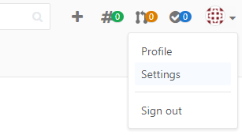
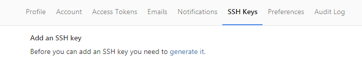

# LibraryUI

This is the second part of the Library Application: [https://github.com/florae123/LibraryApp-user](https://github.com/florae123/LibraryApp-user).

This part consists of a Node.js server and the web UI.
It is built using HTML, CSS, Bootstrap, jQuery, and a Watson Text-To-Speech Service, a Watson Conversation Service as well as the App ID Service on Bluemix.

This first part is a backend server running on Java Liberty on Bluemix that connects to a Cloudant NoSQL Database.

  

## Prerequisites

  The software needed for the following steps:
  * Cloud Foundry Command Line Interface ([Download here](https://github.com/cloudfoundry/cli/releases)),
  * Git tool ([Download here](https://git-scm.com/downloads))

  Another requirement is an IBM Bluemix Account.

### Install the Cloud Foundry CLI

  If the Cloud Foundry Command Line Interface is not yet installed on your machine, use the following commands to install it (for Ubuntu based Linux distributions):

  ```
  # ...first add the Cloud Foundry Foundation public key and package repository to your system
  wget -q -O - https://packages.cloudfoundry.org/debian/cli.cloudfoundry.org.key | sudo apt-key add -
  echo "deb http://packages.cloudfoundry.org/debian stable main" | sudo tee /etc/apt/sources.list.d/cloudfoundry-cli.list
  # ...then, update your local package index, then finally install the cf CLI
  sudo apt-get update
  sudo apt-get install cf-cli
  ```

## Deploy to Bluemix

1. * Deploy the Java back end to Bluemix [https://github.com/florae123/library-server-java-user-adjusted](https://github.com/florae123/library-server-java-user-adjusted) and bind it to a Cloudant NoSQL Database.

   * **Optional:** Connect to an existing app instead of deploying the Java back end yourself. To make sure the app is running, try this link: [https://library-server-demo-1.mybluemix.net/](https://library-server-demo-1.mybluemix.net/)

2. Clone the app to your local environment from your terminal using the following command

    ```
    git clone https://github.com/florae123/libraryui-user-adjusted
    ```

3. * If you deployed your own back end app, you can find the URL of your java library server under **All Apps** on the Bluemix dashboard for the region you used.

     

     Copy the URL.

     

     Open the file **manifest.yml** and change the **"LIBRARY_URI"** to the URL of your java library server and add **"/api"** at the end: **https://[YOUR_LIBRARY_SERVER_URL]/api**

    * **Optional:** If you want to use an existing back end server, copy the URL "https://library-server-demo-1.mybluemix.net/api" to the file **manifest.yml**. It should look like this:

      ```
      LIBRARY_URI: "https://library-server-demo-1.mybluemix.net/api"
      ```

    Change the host name *LibraryUI-[myName]* to something unique. For example, you can replace [myName] with your name.

    ```
    applications:
    - name: LibraryUI
      host: libraryui-tsuedbro
      env:
        LIBRARY_URI: "https://library-server-tsuedbro.mybluemix.net/api"
      memory: 64M
      instances: 1
    ```

4. Log in to your Bluemix account using the Cloud Foundry CLI tool.

	```
	cf login
	```

5.  * Create a Node.JS Cloud Foundry App on Bluemix.
      Give it the same name (**LibraryUI**) and host name as defined in the **manifest.yml** file.

      

    * Create a toolchain for this Cloud Foundry app:
      In the **Overview** section of the app, click **Enable** under **Continuous Delivery**.

      

      Choose **repository type: new** to create a new git repository for your app.

      

      Click on the **Git** icon in your toolchain. You will be redirected to the GitLab repository.

      

6. Create a Watson Text-To-Speech Service and connect it to the app LibraryUI.

7. Create a Watson Conversation Service and bind it to the app. Launch, and import a workspace using the file **conversation-workspace-user-adjusted.json**. Connect it to the app.

    * Select **Conversation** from the Bluemix Catalog in your Browser, make sure the *Free* pricing plan is selected and click **Create**. You will be directed to a view of the service.
    * To bind this service instance to the node.js application, open the **Connections** panel, and click **Create Connection**. Then select the LibraryUI applicaton and click **Connect**. You can hold off restaging the application until the end of step 8.
    * Open the **Manage** panel and click **Launch tool**.

        

    * Under **Create workspace**, click **Import**.
    * Choose the file **conversation-workspace-user-adjusted.json** from your local copy of the LibraryUI directory, select **Everything (Intents, Entities, and Dialog)**, and click **Import**.

        

    * Go **back to workspaces** and click **View Details** on the Libray Helper workspace.

        

    * Copy the **Workspace ID** to the clipboard.
    * Replace it with the current value for *workspace_id_copy* in line 126 in **server.js**.

        ```
        //authenticate conversation service
        var workspace_id_copy = 'YOUR_WORKSPACE_ID';
        ```
8. Create an instance of the App ID Service on Bluemix:

    * Select the App ID Service from the Catalog.
    * Name your service instance and click **Create**.
    * You can keep the default configurations under *Identity Providers*, *Login Customization* and *Profiles*. Or you can adjust them as you choose, for example by uploading the image **views/images/bookshelf.jpg** in the login cumstomization.
    * Connect it to the app LibraryUI and restage the application when prompted.

9. Push the application code to your git repository. *<your-url>* should be replaced by the url of the GitLab repository.

    ```
    git remote set-url origin <your-url>
    git add *
    git commit -m “first commit”
    git push origin master
    ```
    You may need to add an **SSH key** to your GitLab account.
    To locate an existing SSH key pair:
    ```
    cat ~/.ssh/id_rsa.pub
    ```
    To generate a new SSH key pair:
    ```
    ssh-keygen -t rsa -C "your.email@example.com" -b 4096
    cat ~/.ssh/id_rsa.pub
    ```
    Copy the entire key starting with ssh-rsa.
    Then add your public SSH key to GitLab. Navigate to the 'SSH Keys' tab in your 'Profile Settings'.

      
      
      

    Paste your key in the 'Key' section and give it a relevant 'Title'.
